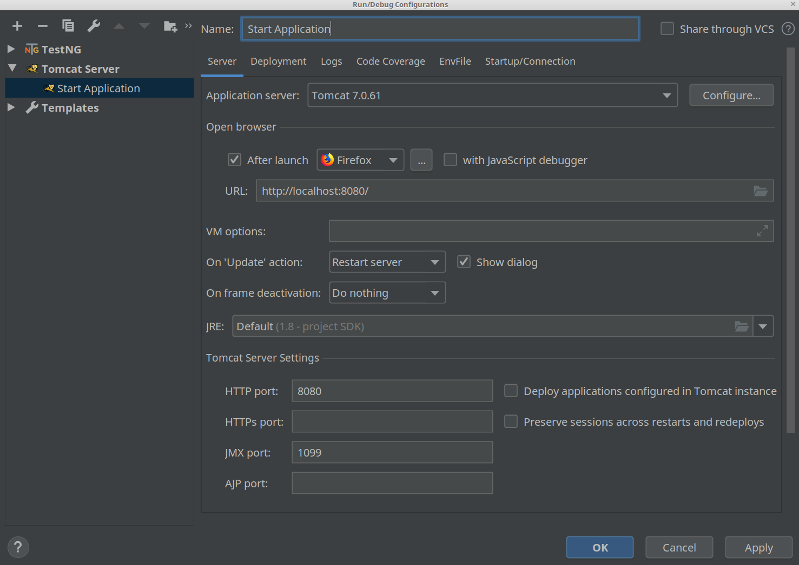

#### For executing tests just execute:
    mvn test
    
##### For test results report open at the browser `report/html/index.html`
---

#### For execution MVC task:

Configure **Tomcat** server: 

Or create `war` from project source and deploy it to Tomcat.

After configuration you can access url:

    localhost:8080
    
---
    
For checking 3 and 4 task just use next credentials for possible users without registration (login and pass are the same):    

    slytseryn@gmail.com     -      REGISTERED_USER
    
    griffindor@gmail.com    -      BOOKING_MANAGER 